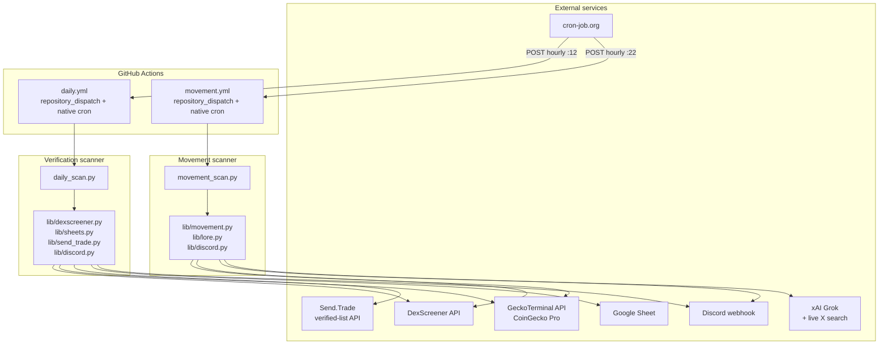

# Send.Trade Monitor

Two cron-driven scanners that automate token discovery and pump/dump tracking for [Send.Trade](https://send.trade), a trading product on Base (with Solana cross-chain). All notifications land in a single Discord channel via webhook.

## What it does

### 1. Verification scanner (`daily_scan.py`)
Surfaces tokens that **meet the Send.Trade verification bar but aren't yet on the verified list**. Posts new pending candidates to a Google Sheet and pings Discord.

### 2. Movement scanner (`movement_scan.py`)
Detects **sharp 1-hour pumps (+80%) and dumps (-50%)** on Base + Solana, generates a "lore" blurb via Grok (live X search) explaining the move, and pings Discord.

Both run hourly 24/7.

## Architecture



## Schedule

| What | When | Trigger |
|---|---|---|
| Verification scan | hourly :12 | cron-job.org webhook → `repository_dispatch: hourly-scan` (primary), GH native cron at `:12 * * * *` (backstop) |
| Movement scan | hourly :22 | cron-job.org webhook → `repository_dispatch: hourly-movement` (primary), GH native cron at `:22 * * * *` (backstop) |

GH Actions native cron silently drops scheduled runs under platform load (often 50%+ on busy days). External cron-job.org is the reliable primary; native is the fallback.

## Filtering criteria

### Verification scanner

A token must clear all of:

| filter | value | scope |
|---|---|---|
| Market cap | ≥ $1,000,000 | all |
| 24h volume | ≥ $1,000,000 | all |
| Liquidity | ≥ $30,000 | all |
| Max market cap | ≤ $1T | all (catches bad-supply scams) |
| Logo on DexScreener | required | incremental mode only |
| Pair age | ≤ 7 days | DS-keyword-discovered tokens only |

**Age bypass:** Tokens surfaced via GeckoTerminal top-volume or trending pools skip the age cap. Top pages are already a volume-validation signal, so an established token like MiroShark (56 days old, currently pumping) doesn't get nuked just for being older than 7 days.

**Sheet behavior:**
- Already on Send.Trade verified list → auto-cleared, never added
- Tokens in `data/dismissed.json` → never re-added (sticky)
- Manual non-pending status in sheet → preserved (no overwrite)

### Movement scanner

| filter | value |
|---|---|
| Pump alert | h1 price change ≥ +80% |
| Dump alert | h1 price change ≤ -50% |
| Min market cap | $1,000,000 |
| Min liquidity per pool | $30,000 |
| Logo on DexScreener | required (filters wash-trade scams) |
| Cooldown | 4h per (chain, address, direction) |

Surviving alerts get a 1-sentence "lore log" via Grok with live X search. Voice spec lives in `lib/lore.py` `SYSTEM_PROMPT` — send.trade trader voice (all lowercase, slang vocab, end-open).

## Discovery sources

The verification scanner combines four discovery channels per run, deduping by `(chain, address)`:

1. **DexScreener token-profiles + token-boosts (latest + top)** — curated trending tokens DS surfaces
2. **DexScreener keyword search** — ~40 queries (chain names, popular tokens, meme tags)
3. **GeckoTerminal top-volume pools** — pages 1-10 per chain (CoinGecko Pro caps at page 10)
4. **GeckoTerminal trending pools** — different sort algorithm, surfaces meme tokens that are buried by stablecoin pairs on top-vol pages

The movement scanner only uses #3 (GT pool data has the per-pool h1/h6 price-change fields we need).

## Chain coverage

| chain | id | notes |
|---|---|---|
| Base | 8453 | EVM, hex addresses (case-insensitive) |
| Solana | 501474 (Send.Trade convention, **not** 101) | base58 addresses (CASE-SENSITIVE) |

Both chains active in `config.json` → `chains`. To disable a chain, move its block into `_chains_disabled`.

---

# Edge cases the dev should know about

These are gotchas we hit and fixed during build — calling them out so they don't bite again.

### 1. Solana base58 addresses are case-sensitive
The original code lowercased addresses uniformly for matching. `EPjFWdd5...` lowercased becomes `epjfwdd5...` — a completely different address in base58. Solana tokens were falsely appearing as "new pending" instead of being matched against Send.Trade's verified list.

Fix lives in `lib/send_trade.py._norm_addr()`. **Always use this helper when keying on `(chain_id, address)`.** Lowercase only for Base (chain_id 8453); preserve case for Solana (501474). All callers updated: `is_verified()`, `sheets.upsert()`, `daily_scan._is_new` flag, dedup logic.

### 2. CoinGecko Pro caps GT pool pagination at page 10
You cannot paginate `/networks/{chain}/pools` past page 10 on the Basic tier ($29/mo). Page 11+ returns 401. This matters for Solana because the top 200 pools are dominated by stablecoin pairs (SOL/USDC at $100M+/day each) — meme tokens with $1-5M/day vol live on pages 30+.

Mitigation: we ALSO call `/networks/{chain}/trending_pools` which uses a different (momentum-based) sort that surfaces tokens hidden behind stablecoin pools. See `_gt_trending_addresses()` in `lib/dexscreener.py`.

### 3. DexScreener `/tokens/v1` returns only the primary pair
For chains like Base where most volume is on one Uniswap/Aerodrome pool, this is fine. For Solana where liquidity is fragmented across Raydium / Orca / Meteora / OpenBook, the primary pair often shows <5% of real aggregate volume. BONK shows ~$80K vol in its primary pair when real vol is ~$50M.

Mitigation: for Solana candidates ONLY, we re-fetch via `/token-pairs/v1/solana/{addr}` to get the full pair list and aggregate properly. Adds ~1.2s per Solana candidate. See `fetch_new_candidates_ds()` and `refresh_addresses_ds()`.

### 4. GitHub Actions cron is unreliable
GH silently drops scheduled runs under platform load. We were getting maybe 6 of 24 expected hourly runs per day. **The fix is NOT a GH paid tier** — even Enterprise customers hit this.

Solution: external scheduler ([cron-job.org](https://cron-job.org), free) POSTs to GH's `repository_dispatch` endpoint every hour. Both workflows have `on: repository_dispatch` triggers; native cron is kept as a backstop.

Setup of the external scheduler is manual (one-time). Two jobs:
- URL: `https://api.github.com/repos/<owner>/<repo>/dispatches`
- Method: POST
- Headers: `Authorization: Bearer <GH_PAT>`, `Accept: application/vnd.github+json`, `X-GitHub-Api-Version: 2022-11-28`, `Content-Type: application/json`
- Body: `{"event_type": "hourly-scan"}` for daily, `{"event_type": "hourly-movement"}` for movement
- Schedule: `12 * * * *` and `22 * * * *` respectively

The GH PAT needs **Contents: Read and write** permission for the repository — common gotcha is using Read-only which 403s. See "Credential rotation" section for setup.

### 5. The `<7d age` filter is bypassed for GT-discovered tokens
DS keyword search produces a lot of long-tail noise, so we age-gate it. But GT top-pool addresses are already volume-validated — established tokens like MiroShark (56 days old) that grew into our thresholds shouldn't be excluded for being "too old." Tracked via `gt_addr_set` membership in `fetch_new_candidates_ds`.

### 6. Lore voice iteration
The Grok system prompt went through several rewrites. Final voice = "send.trade trader chat" — all lowercase, ground in numbers, end-open posts, banned filler list ("degens aped", "shipping nonstop", etc.). See `lib/lore.py` `SYSTEM_PROMPT`. The scrub layer (`_scrub`) enforces lowercasing + strips citation markers + project-handle @s before output.

External KOL @handles (`@jkrdoc`, `@Uniswap`) are kept. Project's own @handle is stripped (`@dphnAI` → `dphnAI`). The handle to strip is passed at call-site from `mover["x_handle"]`.

### 7. Workflows can auto-disable after 60 days inactivity
GH disables scheduled workflows in repos with no commits for 60 days. Both workflows commit data files (`data/snapshots/`, `data/movement_alerts.json`, `data/dismissed.json`) every run, which prevents this. Don't strip those commit steps.

### 8. Solana memes' total vol can be aggregated, but top-10 GT page floor is ~$8M/pool
Even with the fix in (3), the discovery step won't surface mid-cap Solana memes whose top single pool has <$8M/day vol. They simply never enter the `discovery_addrs` set. The trending_pools endpoint partially addresses this, but if you want truly comprehensive Solana coverage, additional discovery (Raydium/Orca-specific pool listings, DS profile/boosts heavier weighting) would help.

---

# Repo layout

```
send-trade-monitor/
├── daily_scan.py              # verification scanner entrypoint
├── movement_scan.py           # pump/dump scanner entrypoint
├── auth.py                    # one-time Google OAuth flow (run locally, generates token.json)
├── config.json                # thresholds, chains, sheet ID, endpoints
├── requirements.txt
├── README.md                  # this file
├── SKILL.md                   # original spec (historical, kept for context)
├── .github/workflows/
│   ├── daily.yml              # cron + repository_dispatch trigger
│   └── movement.yml           # cron + repository_dispatch trigger
├── lib/
│   ├── dexscreener.py         # DS + GT discovery, candidate filtering
│   ├── send_trade.py          # verified-list fetcher + address normalization
│   ├── sheets.py              # gspread upsert with status lifecycle
│   ├── decimals.py            # on-chain decimals lookup with cache
│   ├── discord.py             # webhook poster (daily summary + movement alert)
│   ├── movement.py            # GT pool-level pump/dump detection
│   └── lore.py                # Grok lore generation via xAI Responses API
├── data/
│   ├── snapshots/             # daily JSON snapshots (auto-committed by daily.yml)
│   ├── dismissed.json         # sticky dismiss list (auto-committed)
│   ├── movement_alerts.json   # 48h cooldown state (auto-committed by movement.yml)
│   └── decimals_cache.json    # decimals lookup cache (auto-committed)
└── credentials/               # gitignored — local OAuth client_secret JSON only
```

# Setup

## GitHub Actions secrets

| secret | purpose | how to get |
|---|---|---|
| `DISCORD_WEBHOOK_URL` | Notifications channel | Discord channel → Integrations → Webhooks |
| `GOOGLE_OAUTH_TOKEN` | Write to candidate sheet | Run `python auth.py` locally → contents of `token.json` |
| `GECKOTERMINAL_API_KEY` | CoinGecko Pro tier (300 req/min) | [pro.coingecko.com](https://pro.coingecko.com) |
| `XAI_API_KEY` | Grok lore generation | [console.x.ai](https://console.x.ai) |
| `ALCHEMY_API_KEY` *(optional)* | On-chain Base decimals | [alchemy.com](https://www.alchemy.com) |
| `HELIUS_API_KEY` *(optional)* | On-chain Solana decimals | [helius.dev](https://www.helius.dev) |

`GOOGLE_SHEETS_CREDENTIALS` is unused (we use user OAuth, not service account). Can be removed.

## External cron (cron-job.org)

Two jobs configured, both POSTing to GitHub's repository_dispatch endpoint (see edge case #4 for the exact body/headers).

The cron-job.org account is currently in Austin's name. **For the credential rotation, the dev will need to either get added to that account or set up their own.**

## Local development

```bash
git clone git@github.com:beawesomelee/send-trade-monitor.git
cd send-trade-monitor

# Python 3.11+ (3.9 doesn't support set | None type syntax used in lib/dexscreener.py)
pip install -r requirements.txt

# Local env vars
cp .env.example .env  # if .env.example exists; otherwise create .env manually
# Fill in: DISCORD_WEBHOOK_URL, GOOGLE_OAUTH_TOKEN (or token.json next to script), GECKOTERMINAL_API_KEY, XAI_API_KEY

# One-time Google OAuth (writes token.json)
python auth.py

# Dry runs (no writes, no Discord)
python daily_scan.py --dry-run
python movement_scan.py --h6-fallback   # falls back to h6 if h1 is empty

# Real runs
python daily_scan.py
python movement_scan.py --alert
```

---

# Credential rotation checklist (for handoff)

Some keys were pasted in Claude conversations during build and should be rotated before transferring this project. Run through this list:

### 🔴 Rotate (in chat history)

- [ ] **CoinGecko API key** ([pro.coingecko.com](https://pro.coingecko.com) → API Keys → revoke old + generate new)
  → update GH Actions secret `GECKOTERMINAL_API_KEY`
- [ ] **xAI API key** ([console.x.ai](https://console.x.ai) → API Keys → revoke old + generate new)
  → update GH Actions secret `XAI_API_KEY`
- [ ] **GitHub PAT** (used by cron-job.org)
  → [github.com/settings/personal-access-tokens](https://github.com/settings/personal-access-tokens) → revoke old + generate new fine-grained PAT
  → scopes needed: `Contents: Read+Write`, `Actions: Read+Write`, repo scope = `send-trade-monitor`
  → update the Authorization header value on BOTH cron-job.org jobs (use `Bearer <new_pat>`)
- [ ] **Google OAuth token** *(only if Austin wants to disconnect his personal Google account)*
  → revoke at [myaccount.google.com → Security → Third-party apps](https://myaccount.google.com/permissions)
  → re-run `python auth.py` from the new operator's machine
  → update GH Actions secret `GOOGLE_OAUTH_TOKEN`

### ✅ Keep (no rotation needed)

- Discord webhook URL — shared channel, dev uses same
- Google Sheet ID — same sheet

### 🗑 Delete from GH secrets (no longer used)

- `TELEGRAM_BOT_TOKEN`
- `TELEGRAM_CHAT_ID`
- `GOOGLE_SHEETS_CREDENTIALS` (we use OAuth, not service account)

---

# Future improvements

Areas the dev can take this further.

### 1. Push lore automatically to Send.Trade via `/admin/lore/logs`
Right now the movement scanner generates a 1-sentence lore blurb but only posts to Discord. Send.Trade has a write endpoint that takes the same content:

```
POST /admin/lore/logs
Authorization: Basic <base64(":" + DOCS_PASSWORD)>
Content-Type: application/json
{
  "tokenAddress": "0x...",      // required, 40-char hex (lowercased server-side)
  "description": "...",          // required, 1-4000 chars
  "image": "https://...",        // optional, ≤1024 chars
  "category": "genesis|team|cto|partnership|milestone|listing|incident|update|community",
  "sortOrder": 0                 // optional, int
}
```

Wire `lib/lore.py`'s output (or a richer version) into this endpoint after the movement scanner detects + lore-generates a token. Suggested category mapping:
- new pump with team activity → `update` or `milestone`
- dump with no clear catalyst → skip (don't post)
- KOL shoutout → `community`

Needs `DOCS_PASSWORD` as a new GH Actions secret.

### 2. Auto-verification (if Send.Trade exposes a write API for it)
If there's an `/admin/verify` or similar endpoint, this scanner already has all the signal needed to flag candidates as ready-to-verify. Right now it just dumps them in a Google Sheet for manual review.

### 3. Per-chain configurable thresholds
Today thresholds are global. Solana memes might benefit from looser MC/liq floors (smaller absolute size but real interest) while Base bluechips should stay at $1M+. Move thresholds into `config.json` → `chains[].thresholds` and have `dexscreener.py` read per-chain.

### 4. A/B test framework for criteria
Add a `--criteria-shadow` mode that runs an alternative threshold set in parallel and reports what WOULD have surfaced. Lets you tune thresholds against real data without flipping the live config.

### 5. Performance: parallelize API calls
`fetch_new_candidates_ds` runs API calls sequentially with 1.2s delays. For ~700 addresses across both chains, that's ~14 minutes. Switching to `asyncio` + `aiohttp` with bounded concurrency (10-20 parallel) would cut this to ~1-2 minutes.

### 6. Migrate `dismissed.json` + `movement_alerts.json` to a real DB
Both files get committed back to the repo every run, which churns git history. SQLite via Litestream, Supabase, or even Redis would be cleaner. Trade-off: more infra.

### 7. Add `repository_dispatch` event-type validation
Currently any `repository_dispatch` event with any `event_type` will trigger the workflow. Lock it down by adding `if: github.event.action == 'hourly-scan'` to the job to prevent rogue dispatches from running it.

### 8. GH Actions Node.js 24 migration
`actions/checkout@v4` and `actions/setup-python@v5` are on Node 20, which GH will force to Node 24 by mid-2026. Bump to latest before September 2026 when Node 20 is removed.

### 9. Movement scanner trending_pools for Solana
The verification scanner uses `_gt_trending_addresses` to catch Solana memes hidden behind stablecoin pools. The movement scanner does NOT. If you want better coverage of Solana h1 pumps, add the same trending source to `find_movers`.

### 10. Discord thread per-token
Right now all alerts post into the same channel. Consider creating a thread per detected mover so follow-up discussion stays scoped. Discord webhook supports `thread_id` and `thread_name` params.

### 11. Test coverage
There are zero tests right now. The trickiest path (`lib/dexscreener.py` filter logic, especially the Solana case-sensitivity + aggregation) would benefit from snapshot tests against fixed DS/GT response fixtures.

---

# Operations

### Where to find things

- **Live Discord channel**: configured via `DISCORD_WEBHOOK_URL`
- **Google Sheet**: see `config.json` → `google_sheet.sheet_id`
- **Most recent runs**: [GitHub Actions tab](https://github.com/beawesomelee/send-trade-monitor/actions)
- **External cron status**: [console.cron-job.org](https://console.cron-job.org) (login: Austin's account)
- **Daily snapshots**: `data/snapshots/YYYY-MM-DD.json` (auto-committed every run)

### What "nothing happened today" usually means

The system is silent when:
- No token hit +80% h1 / -50% h1 (which is most days — the bar is intentionally high)
- All discovered candidates are either already verified, already in sheet, or below thresholds
- Filters dropped a candidate (e.g., no logo = wash-trade scam)

A run that shows `new=0, updated=N, verified=N` is HEALTHY, not broken. Notifications gate on `new_pending > 0` for daily, and `survives all filters` for movement.

### Costs

| service | tier | cost |
|---|---|---|
| GitHub Actions | Free (private repo, ~2000 min/mo cap) | $0 |
| CoinGecko Pro | Basic | $29/mo |
| cron-job.org | Free | $0 |
| xAI Grok | Pay-per-token (opt into data sharing for $175/mo credits) | $0-5/mo |
| DexScreener | Free | $0 |

**Total: ~$30/mo** assuming the xAI free credits are active.
