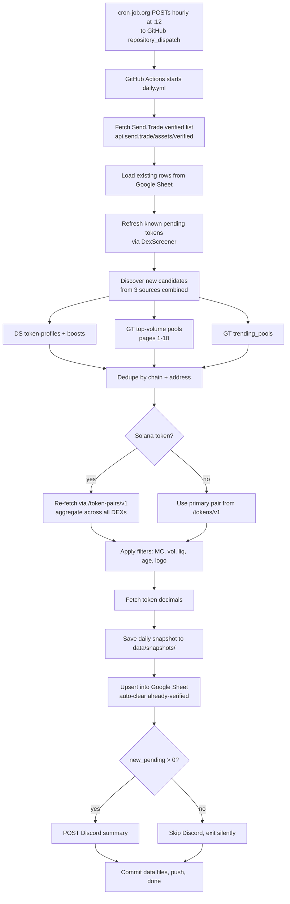
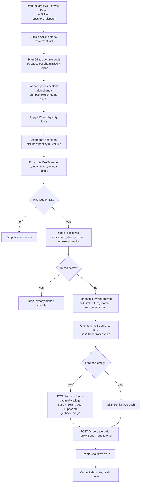

# Send.Trade Monitor

Two cron-driven scanners that automate token discovery and pump/dump tracking for [Send.Trade](https://send.trade), a trading product on Base (with Solana cross-chain). All notifications land in a single Discord channel via webhook.

## What it does

### 1. Verification scanner (`daily_scan.py`)
Surfaces tokens that meet the Send.Trade verification bar but aren't yet on the verified list. Posts new pending candidates to a Google Sheet and pings Discord.

### 2. Movement scanner (`movement_scan.py`)
Detects sharp 1-hour pumps (≥+80%) and dumps (≤-50%) on Base + Solana, generates a 1-sentence lore blurb via Grok (live X search) explaining the move, and pings Discord. The lore is also auto-posted to Send.Trade's admin panel via `POST /admin/lore/logs` so it lands directly in the product UI (both Base and Solana addresses supported). The Discord alert surfaces the resulting lore ID so Austin can delete from the admin panel if a particular auto-post isn't relevant.

Both run hourly 24/7.

## Architecture

### Verification scanner flow (daily.yml + daily_scan.py)



### Movement scanner flow (movement.yml + movement_scan.py)



## Schedule

| What | When | Trigger |
|---|---|---|
| Verification scan | hourly :12 | cron-job.org webhook → `repository_dispatch: hourly-scan` (primary), GH native cron at `:12 * * * *` (backstop) |
| Movement scan | every 15 min | cron-job.org webhook → `repository_dispatch: hourly-movement` (primary), GH native cron at `7,22,37,52 * * * *` (backstop) |

GH Actions native cron silently drops scheduled runs under platform load (often 50%+ on busy days). External cron-job.org is the reliable primary; native is the fallback.

## Filtering criteria

### Verification scanner

A token must clear all of:

| filter | value | scope |
|---|---|---|
| Market cap | ≥ $1,000,000 | all |
| 24h volume | ≥ $1,000,000 | all |
| Liquidity | ≥ $30,000 | all |
| Max market cap | ≤ $1T | all (catches bad-supply scams) |
| Logo on DexScreener | required | incremental mode only |
| Pair age | ≤ 7 days | DS-keyword-discovered tokens only |

**Age bypass:** Tokens surfaced via GeckoTerminal top-volume or trending pools skip the age cap. Top pages are already a volume-validation signal, so an established token like MiroShark (56 days old, currently pumping) doesn't get nuked just for being older than 7 days.

**Sheet behavior:**
- Already on Send.Trade verified list → auto-cleared, never added
- Tokens in `data/dismissed.json` → never re-added (sticky)
- Manual non-pending status in sheet → preserved (no overwrite)

### Movement scanner

| filter | value |
|---|---|
| Pump alert | h1 price change ≥ +80% |
| Dump alert | h1 price change ≤ -50% |
| Min market cap | $1,000,000 |
| Min liquidity per pool | $30,000 |
| Logo on DexScreener | required (filters wash-trade scams) |
| Cooldown | 4h per (chain, address, direction). Entries older than 48h are pruned from `data/movement_alerts.json` but the active cooldown window is 4h |

Surviving alerts get a 1-sentence "lore log" via Grok with live X search. Voice spec lives in `lib/lore.py` `SYSTEM_PROMPT` — send.trade trader voice (all lowercase, slang vocab, end-open).

## Discovery sources

The verification scanner combines three discovery channels per run, deduping by `(chain, address)`:

1. **DexScreener token-profiles + token-boosts (latest + top)** — curated trending tokens DS surfaces
2. **GeckoTerminal top-volume pools** — pages 1-10 per chain (CoinGecko Pro caps at page 10)
3. **GeckoTerminal trending pools** — different sort algorithm, surfaces meme tokens that are buried by stablecoin pairs on top-vol pages

An earlier version had a fourth source — DexScreener keyword search across ~45 queries — but it was removed after attribution showed it contributed zero unique candidates that survived our filters (every hit was also reachable via GT). To revive: hit `https://api.dexscreener.com/latest/dex/search?q=<term>` per term and merge into the discovery set in `_ds_wide_discovery`.

The movement scanner only uses GT top pools (per-pool h1/h6 price-change fields are what it needs).

## Chain coverage

| chain | id | notes |
|---|---|---|
| Base | 8453 | EVM, hex addresses (case-insensitive) |
| Solana | 501474 (Send.Trade convention, not the standard 101) | base58 addresses, case-sensitive |

Both chains active in `config.json` → `chains`. To disable a chain, move its block into `_chains_disabled`.

---

# Edge Cases

Gotchas we hit and fixed during build, called out so they don't bite again.

### 1. Solana base58 addresses are case-sensitive
The original code lowercased addresses uniformly for matching. `EPjFWdd5...` lowercased becomes `epjfwdd5...` — a completely different address in base58. Solana tokens were falsely appearing as "new pending" instead of being matched against Send.Trade's verified list.

Fix lives in `lib/send_trade.py._norm_addr()`. It lowercases only for Base (chain_id 8453) and preserves case for Solana (501474). Callers: `is_verified()`, `sheets.upsert()`, and `daily_scan._is_new` flag use `_norm_addr` directly. The `_incremental_discovery` dedup uses an equivalent inline expression (`addr.lower() if chain == "base" else addr`) — same behavior, just hasn't been refactored to call `_norm_addr`. When extending: prefer `_norm_addr` over duplicating the logic.

### 2. CoinGecko Pro caps GT pool pagination at page 10
You cannot paginate `/networks/{chain}/pools` past page 10 on the Basic tier ($29/mo). Page 11+ returns 401. This matters for Solana because the top 200 pools are dominated by stablecoin pairs (SOL/USDC at $100M+/day each) — meme tokens with $1-5M/day vol live on pages 30+.

Mitigation: we ALSO call `/networks/{chain}/trending_pools` which uses a different (momentum-based) sort that surfaces tokens hidden behind stablecoin pools. See `_gt_trending_addresses()` in `lib/dexscreener.py`.

### 3. DexScreener `/tokens/v1` returns only the primary pair
For chains like Base where most volume is on one Uniswap/Aerodrome pool, this is fine. For Solana where liquidity is fragmented across Raydium / Orca / Meteora / OpenBook, the primary pair often shows <5% of real aggregate volume. BONK shows ~$80K vol in its primary pair when real vol is ~$50M.

Mitigation: for Solana candidates ONLY, we re-fetch via `/token-pairs/v1/solana/{addr}` to get the full pair list and aggregate properly. Adds ~1.2s per Solana candidate. See `fetch_new_candidates_ds()` and `refresh_addresses_ds()`.

### 4. GitHub Actions cron is unreliable
GH silently drops scheduled runs under platform load. We were getting maybe 6 of 24 expected hourly runs per day. A GH paid tier does not fix this, the issue is documented across all tiers including Enterprise.

Solution: external scheduler ([cron-job.org](https://cron-job.org), free) POSTs to GH's `repository_dispatch` endpoint every hour. Both workflows have `on: repository_dispatch` triggers; native cron is kept as a backstop.

Setup of the external scheduler is manual (one-time). Two jobs:
- URL: `https://api.github.com/repos/<owner>/<repo>/dispatches`
- Method: POST
- Headers: `Authorization: Bearer <GH_PAT>`, `Accept: application/vnd.github+json`, `X-GitHub-Api-Version: 2022-11-28`, `Content-Type: application/json`
- Body: `{"event_type": "hourly-scan"}` for daily, `{"event_type": "hourly-movement"}` for movement
- Schedule: `12 * * * *` and `22 * * * *` respectively

The GH PAT needs Contents: Read and write permission for the repository. A common gotcha is using Read-only, which returns 403. See "Credential rotation" section for setup.

### 5. The `<7d age` filter is bypassed for GT-discovered tokens
DS profile/boost discoveries can include long-tail tokens, so we age-gate that path. But GT top-pool addresses are already volume-validated — established tokens like MiroShark (56 days old) that grew into our thresholds shouldn't be excluded for being "too old." Tracked via `gt_addr_set` membership in `fetch_new_candidates_ds`.

### 6. Lore voice iteration
The Grok system prompt went through several rewrites. Final voice = "send.trade trader chat" — all lowercase, ground in numbers, end-open posts, banned filler list ("degens aped", "shipping nonstop", etc.). See `lib/lore.py` `SYSTEM_PROMPT`. The scrub layer (`_scrub`) enforces lowercasing + strips citation markers + project-handle @s before output.

External KOL @handles are kept (the `@` survives), but `_scrub` lowercases the entire output as a final pass, so `@Uniswap` will render as `@uniswap`. Project's own @handle is stripped entirely (`@dphnAI` → `dphnai` after lowercasing). The project handle to strip is passed at call-site from `mover["x_handle"]`.

### 7. Workflows can auto-disable after 60 days inactivity
GH disables scheduled workflows in repos with no commits for 60 days. Each workflow has a final "commit data files" step:
- `daily.yml` commits `data/snapshots/`, `data/decimals_cache.json`, `data/dismissed.json`
- `movement.yml` commits `data/movement_alerts.json`

Between them there's at least one commit per hour, which keeps both workflows armed. Don't strip those commit steps.

### 8. Solana memes' total vol can be aggregated, but top-10 GT page floor is ~$8M/pool
Even with the fix in (3), the discovery step won't surface mid-cap Solana memes whose top single pool has <$8M/day vol. They simply never enter the `discovery_addrs` set. The trending_pools endpoint partially addresses this, but if you want truly comprehensive Solana coverage, additional discovery (Raydium/Orca-specific pool listings, DS profile/boosts heavier weighting) would help.

### 9. The movement h1 is a rolling window, but we only sample it on a schedule
GeckoTerminal's `price_change_percentage.h1` is a *rolling* 1-hour window (price now vs ~60 min ago), NOT a fixed UTC candle that resets at the top of the hour. So a token up 80% over the trailing hour reads 80% whenever we check it.

The limitation is sampling frequency, not the metric. The scanner snapshots that rolling field on a schedule — so a pump that spikes and reverts between two samples can be missed (the trailing-hour value decays as the spike ages out of the window). We run the movement scanner every 15 min specifically to shrink that blind spot (≈4 chances to catch any 1-hour-window pump before it washes out). If you still miss fast spikes, the next lever is reading the `m15`/`m30` fields alongside `h1` — but those are sharper/noisier (single-block fakeouts), so add them deliberately, not by default.

---

# Repo layout

```
send-trade-monitor/
├── daily_scan.py              # verification scanner entrypoint
├── movement_scan.py           # pump/dump scanner entrypoint
├── auth.py                    # one-time Google OAuth flow (run locally, generates token.json)
├── config.json                # thresholds, chains, sheet ID, endpoints
├── requirements.txt
├── README.md                  # this file
├── SKILL.md                   # original spec (historical, kept for context)
├── .github/workflows/
│   ├── daily.yml              # cron + repository_dispatch trigger
│   └── movement.yml           # cron + repository_dispatch trigger
├── lib/
│   ├── dexscreener.py         # DS + GT discovery, candidate filtering
│   ├── send_trade.py          # verified-list fetcher + address normalization
│   ├── sheets.py              # gspread upsert with status lifecycle
│   ├── decimals.py            # on-chain decimals lookup with cache
│   ├── discord.py             # webhook poster (daily summary + movement alert)
│   ├── movement.py            # GT pool-level pump/dump detection
│   └── lore.py                # Grok lore generation via xAI Responses API
├── data/
│   ├── snapshots/             # daily JSON snapshots (auto-committed by daily.yml)
│   ├── dismissed.json         # sticky dismiss list (auto-committed by daily.yml)
│   ├── movement_alerts.json   # 4h cooldown state, 48h prune horizon (created on first movement run, auto-committed by movement.yml)
│   └── decimals_cache.json    # decimals lookup cache (auto-committed by daily.yml)
└── credentials/               # gitignored — local OAuth client_secret JSON only
```

# Setup

## GitHub Actions secrets

| secret | purpose | how to get |
|---|---|---|
| `DISCORD_WEBHOOK_URL` | Notifications channel | Discord channel → Integrations → Webhooks |
| `GOOGLE_OAUTH_TOKEN` | Write to candidate sheet | Run `python auth.py` locally → contents of `token.json` |
| `GECKOTERMINAL_API_KEY` | CoinGecko Pro tier (300 req/min) | [pro.coingecko.com](https://pro.coingecko.com) |
| `XAI_API_KEY` | Grok lore generation | [console.x.ai](https://console.x.ai) |
| `DOCS_PASSWORD` | Auth for Send.Trade `/admin/lore/logs` auto-post | provided by the Send.Trade team |

On-chain decimal lookups go through the public RPC endpoints (mainnet.base.org and api.mainnet-beta.solana.com — both free, no auth). Volume is low (mostly cached). If rate limits ever bite, add an Alchemy or Helius path back into `lib/decimals.py`.

`GOOGLE_SHEETS_CREDENTIALS` is unused at runtime (we use user OAuth), but `lib/sheets.py` still has the service-account fallback code path (`_load_service_account_creds`). If you keep the GH Actions secret empty, the fallback no-ops and the OAuth path takes over. To fully retire it: delete the secret, remove the env line from `daily.yml`, and delete `_load_service_account_creds` + its caller branch.

## External cron (cron-job.org)

Two jobs configured, both POSTing to GitHub's repository_dispatch endpoint (see edge case #4 for the exact body/headers).

The cron-job.org account is currently in Austin's name. For the credential rotation, the dev will need to either get added to that account or set up their own with new jobs pointing at this repo's dispatches endpoint.

## Local development

```bash
git clone git@github.com:beawesomelee/send-trade-monitor.git
cd send-trade-monitor

# Python 3.11+ (3.9 doesn't support set | None type syntax used in lib/dexscreener.py)
pip install -r requirements.txt

# Local env vars
cp .env.example .env  # if .env.example exists; otherwise create .env manually
# Fill in: DISCORD_WEBHOOK_URL, GOOGLE_OAUTH_TOKEN (or token.json next to script), GECKOTERMINAL_API_KEY, XAI_API_KEY

# One-time Google OAuth (writes token.json)
python auth.py

# Dry runs (no writes, no Discord)
python daily_scan.py --dry-run
python movement_scan.py --h6-fallback   # falls back to h6 if h1 is empty

# Real runs
python daily_scan.py                     # always posts to Discord if new_pending > 0
python movement_scan.py --alert          # production cron always passes --alert; without it, the scanner just prints to console
```

---

# Credential rotation checklist (for handoff)

Some keys were pasted in Claude conversations during build and should be rotated before transferring this project. Run through this list:

### 🔴 Rotate (in chat history)

- [ ] **CoinGecko API key** ([pro.coingecko.com](https://pro.coingecko.com) → API Keys → revoke old + generate new)
  → update GH Actions secret `GECKOTERMINAL_API_KEY`
- [ ] **xAI API key** ([console.x.ai](https://console.x.ai) → API Keys → revoke old + generate new)
  → update GH Actions secret `XAI_API_KEY`
- [ ] **GitHub PAT** (used by cron-job.org)
  → [github.com/settings/personal-access-tokens](https://github.com/settings/personal-access-tokens) → revoke old + generate new fine-grained PAT
  → scope needed: `Contents: Read and write` (only this — the `repository_dispatch` endpoint reads it). Resource: `send-trade-monitor` only.
  → update the Authorization header value on BOTH cron-job.org jobs (use `Bearer <new_pat>`)
- [ ] **Google OAuth token** *(only if Austin wants to disconnect his personal Google account)*
  → revoke at [myaccount.google.com → Security → Third-party apps](https://myaccount.google.com/permissions)
  → re-run `python auth.py` from the new operator's machine
  → update GH Actions secret `GOOGLE_OAUTH_TOKEN`

### ✅ Keep (no rotation needed)

- Discord webhook URL — shared channel, dev uses same
- Google Sheet ID — same sheet

### 🗑 Delete from GH secrets (no longer used)

- `TELEGRAM_BOT_TOKEN` (Telegram integration removed)
- `TELEGRAM_CHAT_ID` (Telegram integration removed)
- `GOOGLE_SHEETS_CREDENTIALS` (only needed if you want to use the service-account fallback path; we use user OAuth)

---

# Future improvements

Areas the dev can take this further. Items without a star came from Austin's original handoff brief. Items marked ⭐ were added by Claude with rationale below.

### 1. Auto-verification (if Send.Trade exposes a write API for it)
If there's an `/admin/verify` or similar endpoint, this scanner already has all the signal needed to flag candidates as ready-to-verify. Right now it just dumps them in a Google Sheet for manual review.

### 2. ⭐ Per-chain configurable thresholds
Today thresholds are global. Solana memes might benefit from looser MC/liq floors (smaller absolute size but real interest) while Base bluechips should stay at $1M+. Move thresholds into `config.json` → `chains[].thresholds` and have `dexscreener.py` read per-chain.

*Why ⭐: Solana and Base have meaningfully different volume profiles. A single threshold set tuned for Base under-catches Solana memes. Cheapest way to improve Solana hit rate without re-architecting discovery.*

### 3. A/B test framework for criteria
Add a `--criteria-shadow` mode that runs an alternative threshold set in parallel and reports what WOULD have surfaced. Lets you tune thresholds against real data without flipping the live config.

### 4. Performance: parallelize API calls
`fetch_new_candidates_ds` runs API calls sequentially with 1.2s delays. For ~700 addresses across both chains, that's ~14 minutes. Switching to `asyncio` + `aiohttp` with bounded concurrency (10-20 parallel) would cut this to ~1-2 minutes. Important context: we're at ~1,800 GH Actions min/mo against the 2,000-min Free-tier cap. Parallelizing buys headroom and lets the dev tighten the cron schedule if needed.

### 5. ⭐ Migrate `dismissed.json` + `movement_alerts.json` to a real DB
Both files get committed back to the repo every run, which churns git history (we're already up to dozens of commits/day from the workflows). SQLite via Litestream, Supabase, or even Redis would be cleaner. Trade-off: more infra.

*Why ⭐: as the system scales, the git-as-DB pattern becomes a real liability — large diffs slow down `git pull`, commit history becomes unreadable, and concurrent runs can produce merge conflicts.*

### 6. ⭐ Add `repository_dispatch` event-type validation
Currently any `repository_dispatch` event with any `event_type` will trigger the workflow. Lock it down by adding `if: github.event.action == 'hourly-scan'` to the job to prevent rogue dispatches from running it.

*Why ⭐: 5-minute security hardening. If the GH PAT ever leaks, an attacker can't trigger arbitrary runs without knowing the event_type. Cheap, no downside.*

### 7. ⭐ GH Actions Node.js 24 migration
`actions/checkout@v4` and `actions/setup-python@v5` are on Node 20, which GH will force to Node 24 by mid-2026. Bump to latest before September 2026 when Node 20 is removed.

*Why ⭐: hard deadline. If you don't migrate, workflows break. Trivial fix (bump action versions).*

### 8. ⭐ Movement scanner trending_pools for Solana
The verification scanner uses `_gt_trending_addresses` to catch Solana memes hidden behind stablecoin pools. The movement scanner does NOT. If you want better coverage of Solana h1 pumps, add the same trending source to `find_movers`.

*Why ⭐: the same fix that materially improved the daily scan's Solana coverage will likely do the same for h1 movement alerts. Direct, proven pattern to copy.*

### 9. ⭐ Discord thread per-token
Right now all alerts post into the same channel. Consider creating a thread per detected mover so follow-up discussion stays scoped. Discord webhook supports `thread_id` and `thread_name` params.

*Why ⭐: as alert volume grows, scrolling the main channel gets noisy. Threads keep each token's lore + chart + team discussion together.*

### 10. ⭐ Test coverage
There are zero tests right now. The trickiest path (`lib/dexscreener.py` filter logic, especially the Solana case-sensitivity + aggregation) would benefit from snapshot tests against fixed DS/GT response fixtures.

*Why ⭐: the chain-normalization bug we caught and fixed (Solana base58 lowercasing) would have been a 5-line snapshot test. Future schema or filter changes deserve regression protection.*

### Summary

Three items (1, 3, 4) came directly from Austin's handoff brief — those are the user-prioritized work. Seven items (2, 5, 6, 7, 8, 9, 10) were added by Claude with rationale in each section. If the dev wants a sensible ordering across both: tackle Austin's #4 (parallelization) first since it unlocks GH Actions minute headroom, Claude's #7 (Node 24) next because of the hard deadline, then work down by impact. Note: a fourth Austin ask — auto-push lore to Send.Trade — is already live (see the "Live ops" section below), so don't re-implement it.

---

# Operations

### Where to find things

- **Live Discord channel**: configured via `DISCORD_WEBHOOK_URL`
- **Google Sheet**: see `config.json` → `google_sheet.sheet_id`
- **Most recent runs**: [GitHub Actions tab](https://github.com/beawesomelee/send-trade-monitor/actions)
- **External cron status**: [console.cron-job.org](https://console.cron-job.org) (login: Austin's account)
- **Daily snapshots**: `data/snapshots/YYYY-MM-DD.json` (auto-committed every run)

### What "nothing happened today" usually means

The system is silent when:
- No token hit +80% h1 / -50% h1 (which is most days — the bar is intentionally high)
- All discovered candidates are either already verified, already in sheet, or below thresholds
- Filters dropped a candidate (e.g., no logo = wash-trade scam)

A run that shows `new=0, updated=N, verified=N` is healthy, not broken. Notifications gate on `new_pending > 0` for daily (see `lib/discord.py.send_summary`, which silently returns when zero) and on at-least-one-mover-survives-all-filters for movement.

### Costs

| service | tier | cost |
|---|---|---|
| GitHub Actions (private repo) | Free, 2,000 min/mo cap | likely $0, possibly throttle-risky |
| CoinGecko Pro | Basic | $29/mo |
| cron-job.org | Free | $0 |
| xAI Grok | Pay-per-token (opt into data sharing for $175/mo credits) | $0-5/mo |
| DexScreener | Free | $0 |

Total: ~$30/mo assuming the xAI free credits are active.

GH Actions usage estimate: 24 daily.yml runs/day × ~2 min + 24 movement.yml runs/day × ~30s = ~60 min/day = ~1,800 min/mo. That's right at the 2,000-min Free-tier cap for private repos. If the daily scan slows down (Solana per-token aggregation already added ~3 min) you may need to upgrade to GitHub Pro ($4/mo, 3,000 min) or make the repo public (unlimited free Actions). The minute cap is the only real cost pressure point.
